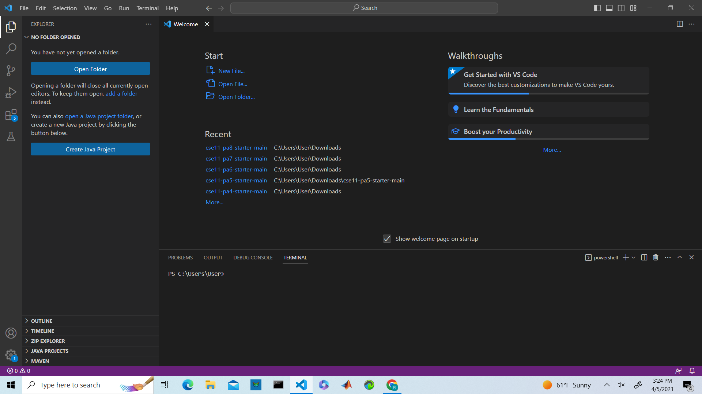
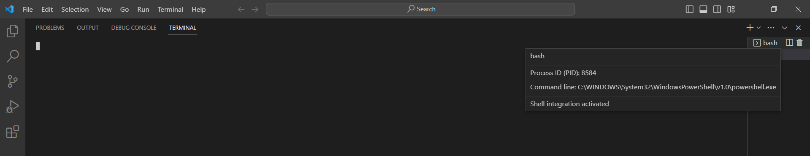

# Lab 1 Report 

## Accessing Account 
The first step to logging into your course account is to find your account information. Go to this [page](https://sdacs.ucsd.edu/~icc/index.php). Insert your UCSD username and student ID to login into the website. Once in you can get your get your account username (should be something like cse15l....) and update your password with the on screen instructions. Once this step is complete you are ready to start using the account. 


## Installing Visual Studio Code 
To install Visual Studio Code you will need to go to this [page](https://code.visualstudio.com/). Follow the steps presented on the website and download 
the appropriate version of Visual Studio code for your computer (Windows) or (MacOs). Once downloaded you can click on the appliaction and the home screen should
look something like this.\


## Installing Git  
To remotely connect to the cilents computer you will need to use bash, to use bash on windows you will need to downlaod git first. To downlaod git go to this 
[page](https://gitforwindows.org/) and follow the instructions. Once git is installed you will be able to access bash from the terminal by clicking down on the arrow
(as seen in this picture on the far right). 


## Connecting Remotely 
Once in the bash terminal you will be able to login to your account by typing in `$ ssh` to the terminal followed by your account username@ieng6.ucsd.edu. You will then be prompted to put in your password (do not worry if the letters are not showing up on your screen as you type then in for this part). Once you have successfully put in the password you be logged into your account and ready to work.

**Login Example:**\


**How your screen should look once logged in:**


## Trying Some Commands 
Once logged in you can start opertaing from the terminal and use any commands you wish. Try testing some of these commands:
```
* cd (used to change directories; moves the command prompt into a different folder, and will display the diretory it changed to)
* cd ~ (used to change directories; moves the command prompt into a different folder, but will not display the diretory it changed to)
* ls -lat (used to display the content of files and directories that are containned in the current directory)   
* ls -a (used to dislay all files, including hidden files in the directory)
* cp /home/linux/ieng6/cs15lsp23/public/hello.txt ~/ (cp is used to copy files and directories to another location, in this case /home/linux/ieng6/cs15lsp23/public/hello.txt ~/ is being copied)
* cat /home/linux/ieng6/cs15lsp23/public/hello.txt (cat is used for concatenating and printing a file, in this case /home/linux/ieng6/cs15lsp23/public/hello.txt)
```

**Here are some testing examples:**


**Examples Explained:** \
In the first example we see `ls` displaying the content of files and directories that are contained within the current directory (all the lines up to @User Desktop). In the second example we see the usage of `cd ~` which changes directories and since `~` is after `cd` the action is done, but nothing is displayed. Lastly in the last example we see the usage of `ls -lat` similar to `ls` we see that it prints out the content of files and directories. However we do see differences, different files are displayed within the two calls;  `ls - lat` displays less than `ls`.  

  
  
  
