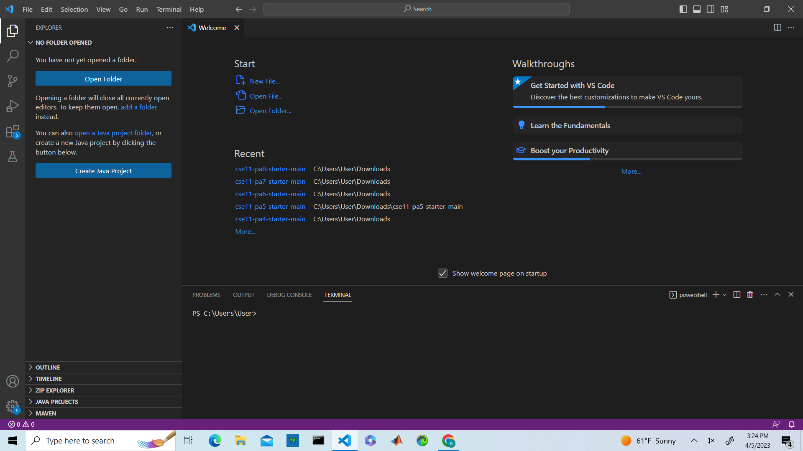
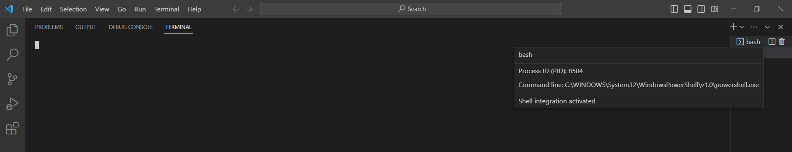

# Lab 1 Report 

## Accessing Account 
  The first step in using to logging into your course account is to find your account information. Go [here](https://sdacs.ucsd.edu/~icc/index.php) to 
  get your account username (should be something like cse15l....) and update your password. Once this step is complete you are ready to start using the account. 
  
## Installing Visual Studio Code 
  To install Visual Studio code you will need to go to this [page](https://code.visualstudio.com/). Follow the steps presented on the website and download 
  the appropiate version of Visual Studio code for your computer (Windows) or (MacOs). Once downloaded you can click on the appliaction and the home screen should
  look something like this.\
  
  
  ## Installing Git  
  To remotely connect to the cilents computer you will need to use bash, to use bash on windows you will need to downlaod git first. To downlaod git go to this 
  [page](https://gitforwindows.org/) and follow the instructions. Once git is installed you will be able tp access bash from the terminal by clicking down on the arrow
  as seen./ 
  
  
  ## Connecting Remotely 
  Once in the bash terminal you will be able to login to your account by typing in $ ssh to the terminal followed by account username@ieng6.ucsd.edu. You will then be 
  prompted to put in your password (do not worry if the letters are not showing up on your screen as you type then in for this part). Once you have successfully put in 
  password you be logged into your account and ready to work. 
  
